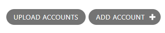
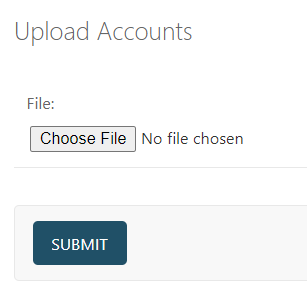

# django-form-button

Django admin extra buttons with form

## Screenshots





## Installation

You can install the package via pip:

```bash
pip install django-form-button
```

## Usage

```python
from django.contrib import admin
from django.forms import FileField
from django.forms import Form
from django.http import HttpRequest
from django.http import HttpResponse

from django_form_button import FormButtonMixin
from django_form_button import form_button

from .models import Account


class UploadForm(Form):
    file = FileField()


@form_button("Upload Accounts", UploadForm)
def upload_accounts(request: HttpRequest, validated_form: Form):
    file = validated_form.cleaned_data["file"]
    return HttpResponse(file.name)


@admin.register(Account)
class AccountAdmin(FormButtonMixin, admin.ModelAdmin):  # type: ignore
    form_buttons = [upload_accounts]

```

## License

This project is licensed under the terms of the MIT license.

## Contributing

Pull requests are welcome. For major changes, please open an issue first to discuss what you would like to change.

## Contact

If you want to contact me you can reach me at pradishbijukchhe@gmail.com.
